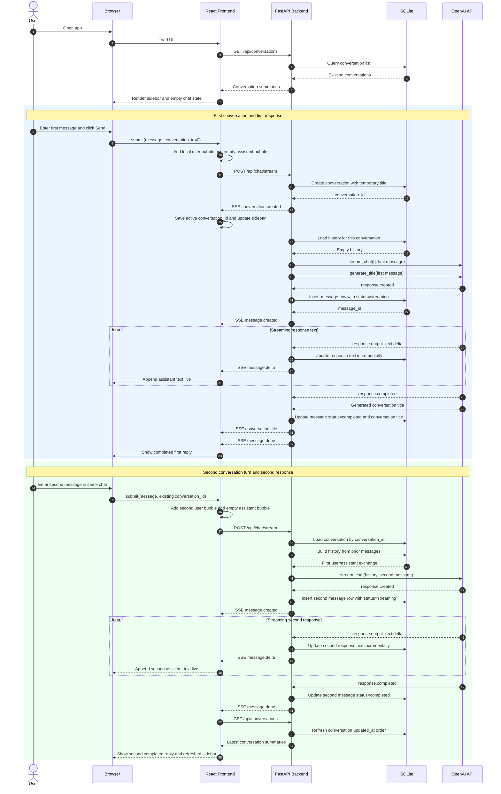
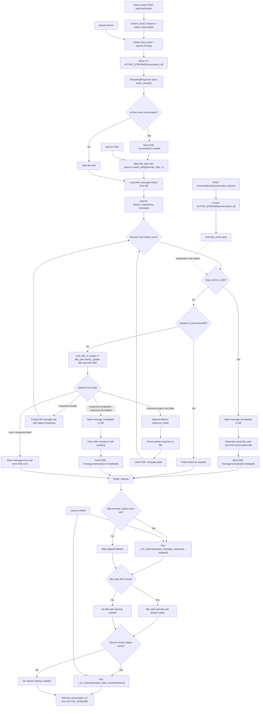

# Minimal ChatGPT-like Web App

FastAPI backend + React frontend + SQLite persistence + OpenAI streaming responses.

## Structure

- `backend/app`: FastAPI app, database models, routes, and OpenAI service
- `frontend`: Vite + React + TypeScript client
- `tests`: backend integration tests

## End-to-End Chat Flow



## Asyncio Stream Control in `backend/app/routes.py`

This diagram focuses on how the backend uses `asyncio` to coordinate one streaming chat request.



### Why these asyncio pieces exist here

- `asyncio.Event`: acts as a shared stop signal between `/chat/stream` and `/conversations/{conversation_id}/stop`
- `asyncio.Task`: lets title generation run in the background so token streaming is not blocked
- `asyncio.shield`: protects cleanup work in `finally` so DB updates and stream closing still run even if the request is being cancelled
- `asyncio.CancelledError`: makes stream cancellation explicit, while still allowing `finally` to clean up shared state

### Mental model

- Main path: stream assistant tokens to the frontend as fast as possible
- Side path: generate a better conversation title in parallel
- Stop path: let another API request signal the stream to stop without force-killing it
- Cleanup path: always try to leave the database and `ACTIVE_STREAMS` in a consistent state

## Environment

Create `.env` from `.env.example` and set at least `OPENAI_API_KEY`.

Available backend settings:

- `OPENAI_API_KEY`: OpenAI API key
- `CHAT_MODEL`: chat model for streaming responses
- `TITLE_MODEL`: model used to generate conversation titles
- `CHAT_SYSTEM_PROMPT`: optional full override for the default chat system prompt
- `FRONTEND_ORIGIN`: allowed frontend origin for CORS
- `LOG_LEVEL`: backend log level such as `INFO` or `DEBUG`
- `LOG_FILE`: backend log file path
- `LOG_DB_CRUD`: whether to log database `SELECT`, `INSERT`, `UPDATE`, and `DELETE`

## Backend

Install Python dependencies:

```powershell
uv sync --group dev
```

Run the API:

```powershell
uv run fastapi dev main.py
```

If you synced dependencies before this repo included the FastAPI CLI extra, refresh them once:

```powershell
uv sync --group dev
```

Fallback command:

```powershell
uv run uvicorn main:app --reload
```

The backend depends on `fastapi[standard]` so the `fastapi` CLI is available after `uv sync`.

## Frontend

Install frontend dependencies:

```powershell
npm install
```

Run the frontend dev server:

```powershell
npm run dev
```

Open the frontend in your browser at:

```text
http://127.0.0.1:5173/
```

The Vite dev server proxies `/api` to `http://127.0.0.1:8000`.

Backend API docs are available at:

```text
http://127.0.0.1:8000/docs
```

Backend logs are written to:

```text
logs/backend.log
```

Logging behavior:

- Logs are written to both the console and `logs/backend.log`
- Log files rotate automatically at about 1 MB per file and keep 5 backups
- Request lifecycle events are logged for incoming HTTP requests and streaming responses
- Database `SELECT`, `INSERT`, `UPDATE`, and `DELETE` statements are logged by default
- `logs/` is ignored by git and will not be committed

## Knowledge Base Import

The workspace Knowledge Base import path is:

```text
Native File -> MarkItDown normalized markdown -> LlamaIndex chunking -> FastEmbed embeddings -> Qdrant
```

Current supported import formats:

- `.txt`
- `.md`
- `.markdown`
- `.pdf`

Current behavior:

- One upload creates one asynchronous Knowledge Base job with one file-level item per file
- Imports are processed automatically by an in-process background queue worker in the FastAPI app
- The Knowledge Base Management screen polls jobs and documents while it stays open, so completed imports should appear without reopening the screen
- Unsupported or failed files stay visible in job history and per-file outcomes, but do not become formal knowledge documents
- Successful replacements create a new revision and keep the previous retrievable revision in place if the new revision fails

If PDF imports fail in a fresh environment, make sure backend dependencies were refreshed after PDF support was added:

```powershell
uv sync --group dev
```

## Tests

Backend:

```powershell
uv run pytest
```

Frontend:

```powershell
npm run test
```
